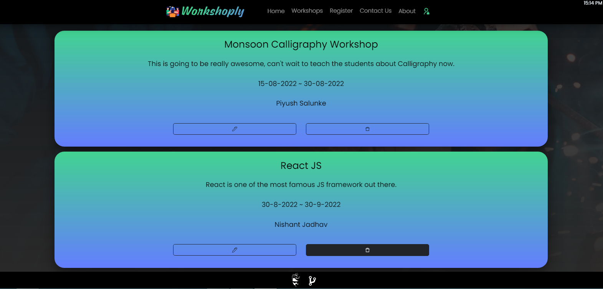

import Callout from 'nextra-theme-docs/callout'
import Bleed from 'nextra-theme-docs/bleed'

# Deleting Workshops
<Bleed></Bleed>
<Bleed></Bleed>

<div className="p-4 border border-gray-200 dark:border-gray-900 rounded mt-6">
**This will delete the specified workshop**

<Callout emoji="✅">
  **Deleting** a workshop will permanently remove all details of the particular workshop in MongoDB Cluster(Atlas), at the same time it will remove that workshop from [Workshops](https://workshop-nj.herokuapp.com/workshops), and the dropdown of [Register](https://workshop-nj.herokuapp.com/register).
</Callout>
</div>

### Operations done till now:
```markdown
- [✔️] Creating Workshops
- [✔️] Reading Workshops
- [✔️] Update Workshops
- [✔️] Deleting Workshops
```