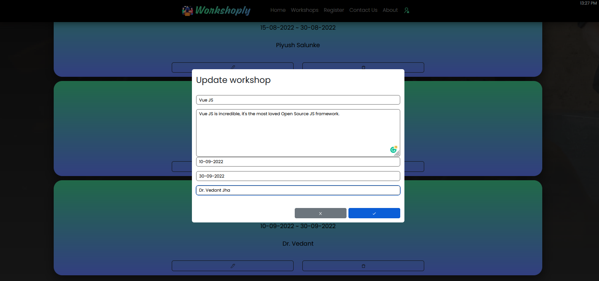

import Callout from 'nextra-theme-docs/callout'
import Bleed from 'nextra-theme-docs/bleed'

# Updating Workshops
<Bleed></Bleed>

<div className="p-4 border border-gray-200 dark:border-gray-900 rounded mt-6">
**This will update the workshop**

<Callout emoji="✅">
  **Updating** a particular workshop will only update the workshop with particular ID in MongoDB Cluster(Atlas), at the same time it will update the workshops at [Workshops](https://workshop-nj.herokuapp.com/workshops), and in the dropdown of [Register](https://workshop-nj.herokuapp.com/register).
</Callout>
</div>

### Operations done till now:
```markdown
- [✔️] Creating Workshops
- [✔️] Reading Workshops
- [✔️] Update Workshops
- [ ] Deleting Workshops
```