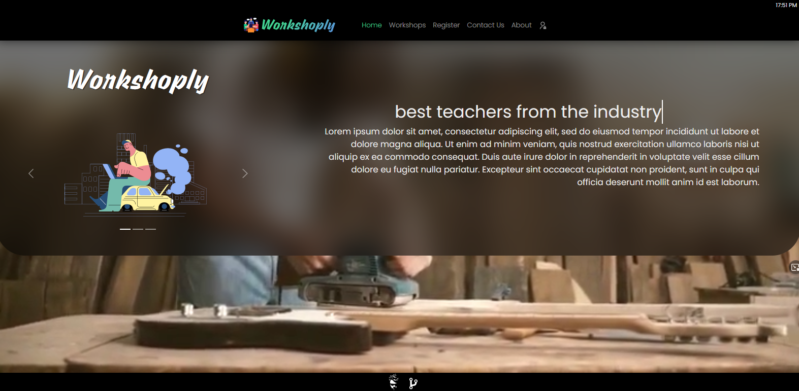

import Bleed from 'nextra-theme-docs/bleed'
import Callout from 'nextra-theme-docs/callout'

# Get Started

## Via the Web

Here's the working example: [Workshoply](https://workshop-nj.herokuapp.com)

<Bleed></Bleed>

## Create Manually

Prequisites:

1. Already installed [Node JS](https://nodejs.org/en/download/), [npm](https://www.npmjs.com/package/npm)/[yarn](https://www.npmjs.com/package/yarn),[React JS](https://www.npmjs.com/package/react), [git bash](https://git-scm.com/downloads) or any terminal, [text editor](https://code.visualstudio.com/).

2. Open Git Bash, get into your preferred directory.

e.g.

```jsx
$ cd d:/projects
```

3. Clone [Workshoply](https://github.com/nisoojadhav/workshop) git repository.

```jsx
$ git clone https://github.com/nisoojadhav/workshop.git
```

4. Get into Workshop folder

```jsx
$ cd workshop
```

5. Install packages:

```jsx
$ npm i
$ cd client
$ npm i
```

6. Start server(resides on root folder):

```jsx
$ node server
```

7. Start project

```jsx
$ cd client && npm start
```

8. You are good to go! Visit [localhost:3000](http://localhost:3000).

<Callout>
  If you ran into some error try visiting
  [stackoverflow](https://stackoverflow.com) or [docs](https//reactjs.org/docs), if error persists send me a [mail](mailto:nisoojadhav@gmail.com).
</Callout>
