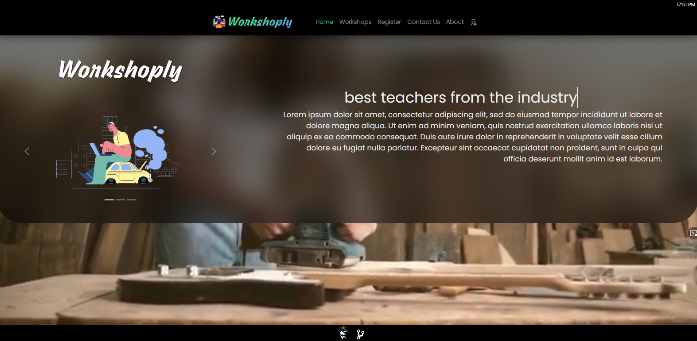

import Bleed from 'nextra-theme-docs/bleed'

# Workshoply

**Workshoply** is a [Full Stack MERN App](https://workshop-nj.herokuapp.com) for managing workshops.

Made on top of React JS ([React](https://github.com/facebook/react)) i.e. highly progressive, fast, file-system based routing, secured, web-app that provides Creating, Reading, Updating, Deleting workshops priviledges for Admin, Reading and Registering priviledges for other users.

Here's the working example: [Workshoply](https://workshop-nj.herokuapp.com)
<Bleed></Bleed>
