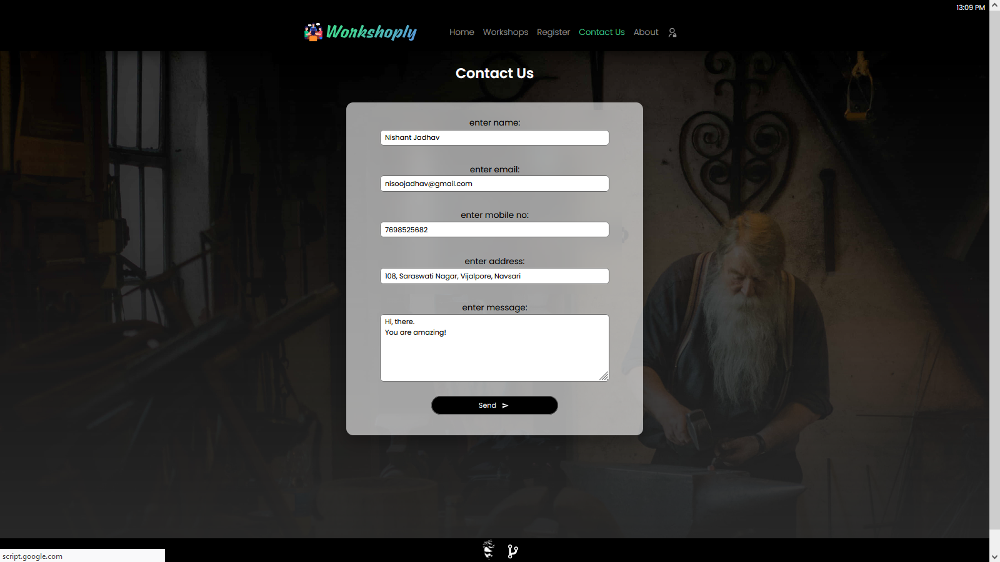
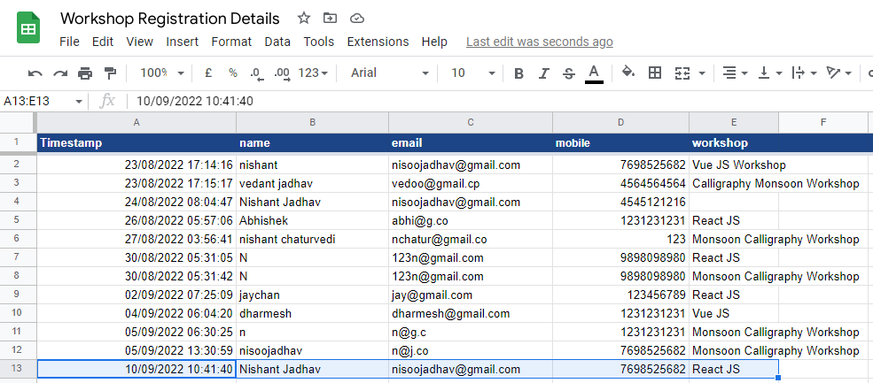

import Bleed from 'nextra-theme-docs/bleed'

# Contact Us

View **[Contact Us](https://workshop-nj.herokuapp.com/contact)** page.
<Bleed></Bleed>

### Simultaneously it will store Contact response in Google Spreadsheet:
<Bleed></Bleed>