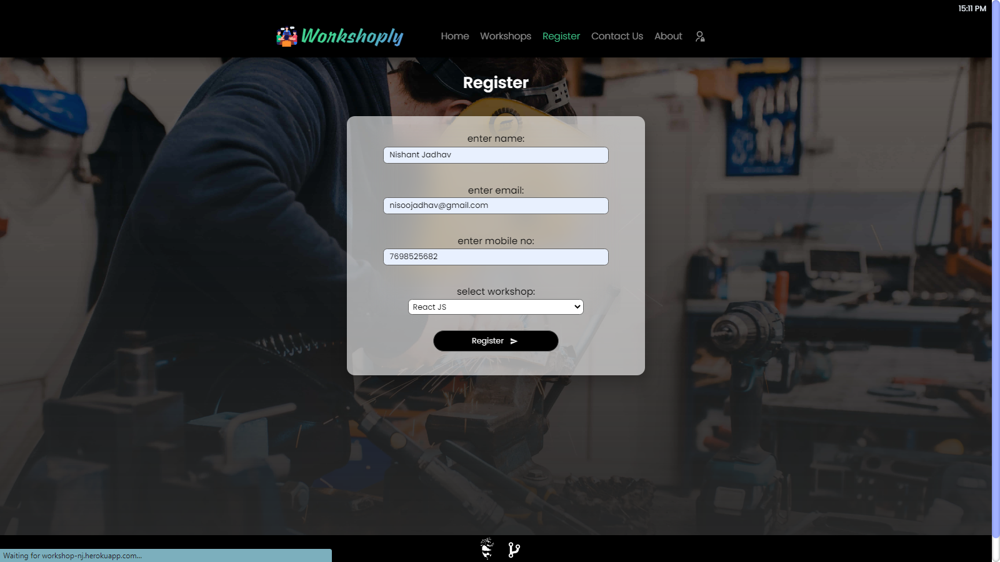

import Bleed from 'nextra-theme-docs/bleed'

# Register
View **[Register](https://workshop-nj.herokuapp.com/register)** page.
<Bleed></Bleed>

### Simultaneously it will store Registration Details in Google Spreadsheet: